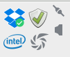

# Improved Dropbox Icons

> Improved Dropbox images for the system tray



### States

| Normal                                      | Idle                                       |
|:-------------------------------------------:|:-------------------------------------------:
|   |    |

| Busy                                        | Busy2                                      |
|:-------------------------------------------:|:------------------------------------------:|
|     |  |

| X                                           |
|:-------------------------------------------:|
|           |


### Installation

* Copy images to appropriate folder

e.g.

```
~/dropbox-dist/dropbox-lnx.x86_64-3.18.1/images/hicolor/16x16/status/
```
